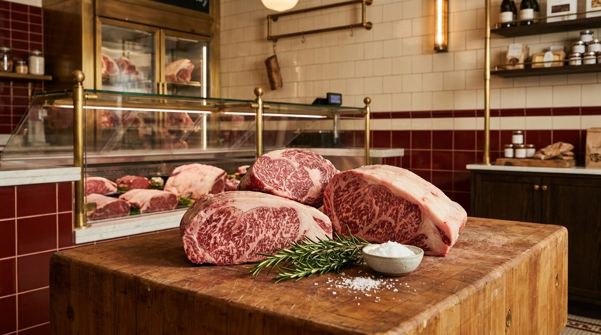
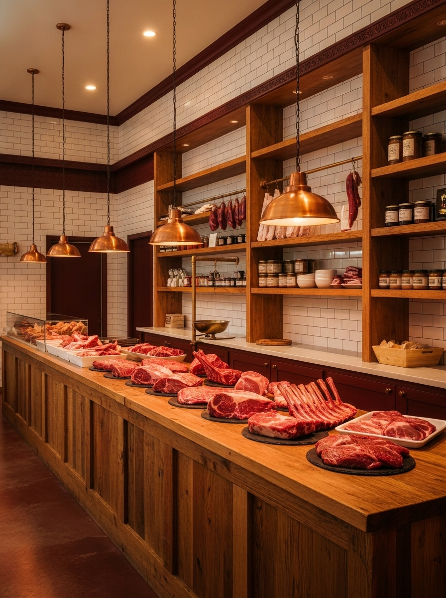
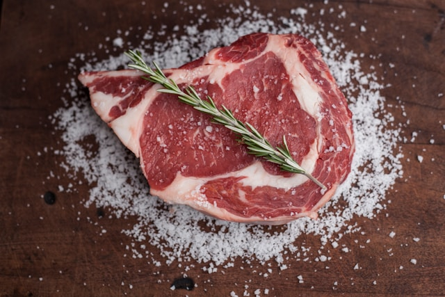
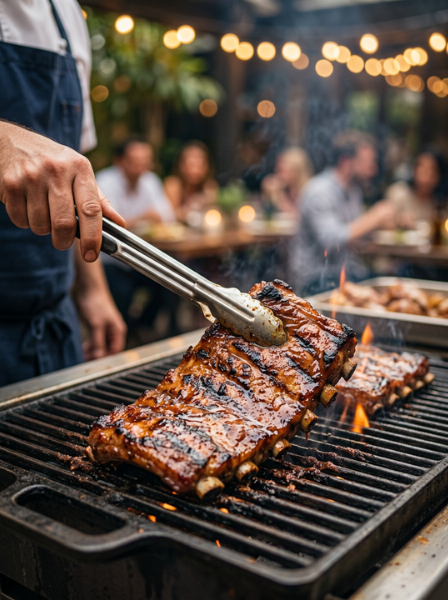
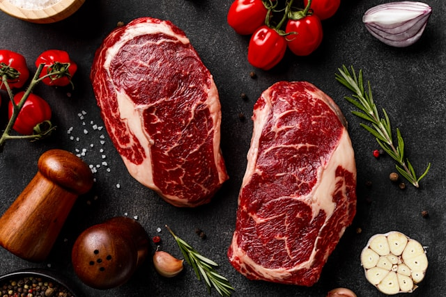
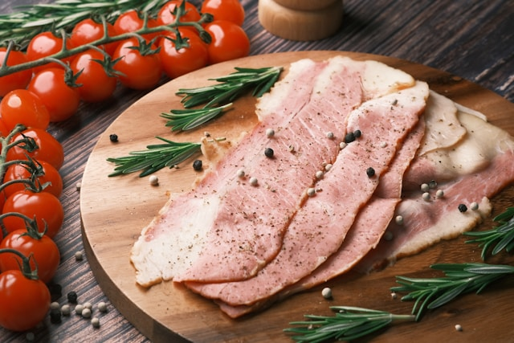
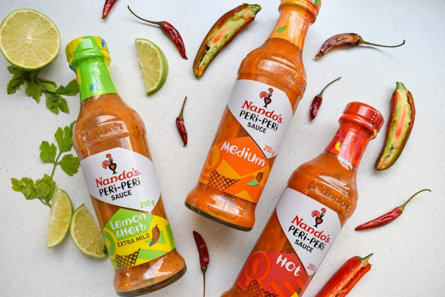

# The Butcher's Block

Premium butcher shop / meat market landing experience built with React and Vite.

[Live Preview](#) • [Project Structure](#project-structure) • [Features](#features) • [Roadmap](#roadmap)

---

## English

### Overview

The Butcher's Block is a modern, responsive storefront concept designed to feel premium, warm, and trustworthy. It focuses on strong visual storytelling through a hero section, curated category cards, weekly deals, and a catering-focused section.

The current build is centered around:
- a strong first impression,
- mobile-first responsive behavior,
- a custom brand color system,
- a scroll-aware navbar,
- card-based product storytelling,
- and a clear path from landing page to products.

### Screenshots

> Images are served from `public/landing/`.









### Features

| Area | Status | Description |
|---|---:|---|
| Fixed Navbar | Done | Scroll-based background change, mobile overlay, mobile menu |
| Hero Section | Done | Strong headline, CTA buttons, hero overlay |
| Heritage Section | Done | Brand story and image-led narrative |
| Categories Section | Done | Product category card showcase |
| Weekly Deals | Done | Promotional deals and fast purchase feel |
| Chef's Touch | Done | Catering / special event section |
| Responsive Layout | Done | Breakpoints for 375, 390, 414, 430, 768, 820, 1024px |
| Product Pages | Scaffold | Routes ready, content still expanding |
| Offers / About / Contact | Scaffold | Page shells ready for future content |

### What I built

- **Mobile-first navbar** with overlay, menu drawer, and scroll state.
- **Premium landing page flow** with hero, story, categories, offers, and catering sections.
- **Custom color system** using gold, cream, primary, secondary, tertiary, neutral, and gray scales.
- **Responsive card layouts** tuned for readability on small screens.
- **UI motion** using hover transitions, scale effects, and animated scroll cue.
- **Route-based architecture** using `react-router-dom`.

### What I want to build next

- Fill the **Products** page with a real grid, filters, and category logic.
- Turn **Offers** into a full promo / discount listing.
- Expand **Catering** into a quote-request and event-service flow.
- Complete **About** with brand story, team, and values.
- Build **Contact** with a form, map, and opening hours.
- Convert **Products Category** into a category-specific product listing.
- Add a real **cart / order** experience.

### Tech Stack

- React 19
- Vite
- React Router DOM
- React Icons
- CSS with nested styling
- ESLint

### Routes

| Route | Page |
|---|---|
| `/` | Home |
| `/products` | Products |
| `/offers` | Offers |
| `/catering` | Catering |
| `/about` | About |
| `/contact` | Contact |
| `/products-category` | Products Category |

### Project Structure

```bash
src/
├─ component/
│  ├─ Navbar/
│  ├─ Footer/
│  └─ ScrollToTop.jsx
├─ page/
│  ├─ Home/
│  │  ├─ Home.jsx
│  │  ├─ Heritage.jsx
│  │  ├─ Categories.jsx
│  │  ├─ WeeklyDeals.jsx
│  │  └─ Chef'sTouch.jsx
│  ├─ Products/
│  ├─ Offers/
│  ├─ Catering/
│  ├─ About/
│  ├─ Contact/
│  └─ ProductsCategory/
├─ App.jsx
├─ App.css
├─ main.jsx
└─ index.css
```

### Getting Started

```bash
npm install
npm run dev
```

Build:

```bash
npm run build
```

Preview:

```bash
npm run preview
```

### Design Notes

- The palette is built around **gold / cream / dark** tones.
- Homepage sections are arranged like a premium showcase.
- Font sizes and spacing are tuned for mobile readability.
- The navbar changes background after scrolling.
- Cards and CTAs stay minimal to keep the luxury feel.

### Notes

Several pages are scaffolded but not fully filled yet. The project is intentionally built as a growing storefront foundation: strong landing experience now, deeper commerce layers later.

---

## Deutsch

### Überblick

The Butcher's Block ist ein modernes, responsives Storefront-Konzept für eine hochwertige Metzgerei bzw. einen Fleischmarkt. Der Fokus liegt auf einer starken visuellen Erzählung mit Hero-Bereich, kuratierten Kategorie-Karten, Wochenangeboten und einem Catering-Bereich.

Der aktuelle Stand konzentriert sich auf:
- einen starken ersten Eindruck,
- mobile-first Responsive-Verhalten,
- ein eigenes Farbsystem,
- eine Navbar, die auf Scroll reagiert,
- Kartenbasierte Produktinszenierung,
- und einen klaren Weg von der Landingpage zu den Produkten.

### Screenshots

> Die Bilder werden aus `public/landing/` geladen.


### Funktionen

| Bereich | Status | Beschreibung |
|---|---:|---|
| Fixierte Navbar | Fertig | Scroll-basierter Hintergrundwechsel, Mobile-Overlay, Mobile-Menü |
| Hero-Bereich | Fertig | Starke Headline, CTA-Buttons, Hero-Overlay |
| Heritage-Bereich | Fertig | Markengeschichte mit Bildsprache |
| Kategorien | Fertig | Produktkategorien als Karten-Showcase |
| Wochenangebote | Fertig | Promo-Angebote und schneller Kauf-Charakter |
| Chef's Touch | Fertig | Catering- / Event-Bereich |
| Responsive Layout | Fertig | Breakpoints für 375, 390, 414, 430, 768, 820, 1024px |
| Produktseiten | Scaffold | Routen vorhanden, Inhalte werden erweitert |
| Offers / About / Contact | Scaffold | Seitenrümpfe für zukünftige Inhalte |

### Was ich gebaut habe

- **Mobile-first Navbar** mit Overlay, Menü und Scroll-State.
- **Premium-Landingpage-Flow** mit Hero, Story, Kategorien, Angeboten und Catering.
- **Eigenes Farbsystem** mit Gold-, Cream-, Primary-, Secondary-, Tertiary-, Neutral- und Gray-Skalen.
- **Responsive Card-Layouts** für gute Lesbarkeit auf kleinen Bildschirmen.
- **UI-Animationen** mit Hover-Transitions, Scale-Effekten und animiertem Scroll-Hinweis.
- **Route-basierte Architektur** mit `react-router-dom`.

### Was ich als Nächstes bauen möchte

- Die **Products**-Seite mit echtem Grid, Filtern und Kategorien füllen.
- **Offers** zu einer vollständigen Promo- / Rabattseite ausbauen.
- **Catering** in einen Angebots- und Event-Flow verwandeln.
- **About** mit Markengeschichte, Team und Werten ergänzen.
- **Contact** mit Formular, Karte und Öffnungszeiten aufbauen.
- **Products Category** in eine kategoriebasierte Produktliste verwandeln.
- Einen echten **Warenkorb / Order-Flow** hinzufügen.

### Tech Stack

- React 19
- Vite
- React Router DOM
- React Icons
- CSS mit Nested Styling
- ESLint

### Routen

| Route | Seite |
|---|---|
| `/` | Home |
| `/products` | Products |
| `/offers` | Offers |
| `/catering` | Catering |
| `/about` | About |
| `/contact` | Contact |
| `/products-category` | Products Category |

### Projektstruktur

```bash
src/
├─ component/
│  ├─ Navbar/
│  ├─ Footer/
│  └─ ScrollToTop.jsx
├─ page/
│  ├─ Home/
│  │  ├─ Home.jsx
│  │  ├─ Heritage.jsx
│  │  ├─ Categories.jsx
│  │  ├─ WeeklyDeals.jsx
│  │  └─ Chef'sTouch.jsx
│  ├─ Products/
│  ├─ Offers/
│  ├─ Catering/
│  ├─ About/
│  ├─ Contact/
│  └─ ProductsCategory/
├─ App.jsx
├─ App.css
├─ main.jsx
└─ index.css
```

### Erste Schritte

```bash
npm install
npm run dev
```

Build:

```bash
npm run build
```

Vorschau:

```bash
npm run preview
```

### Design-Hinweise

- Die Farbpalette basiert auf **Gold / Cream / Dark**.
- Die Startseite ist wie ein hochwertiges Schaufenster aufgebaut.
- Schriftgrößen und Abstände sind für mobile Lesbarkeit optimiert.
- Die Navbar ändert ihren Hintergrund beim Scrollen.
- Karten und CTAs bleiben bewusst minimal, um den Premium-Eindruck zu halten.

### Hinweise

Einige Seiten sind bereits angelegt, aber inhaltlich noch nicht vollständig ausgebaut. Das Projekt ist bewusst als wachsende Storefront-Basis gedacht: heute eine starke Landingpage, später mehr Commerce-Tiefe.
